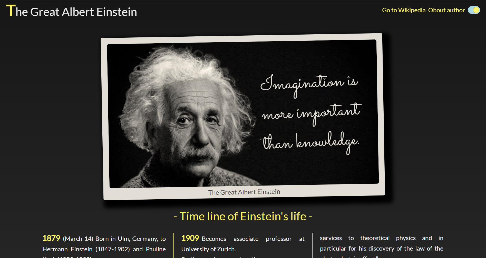
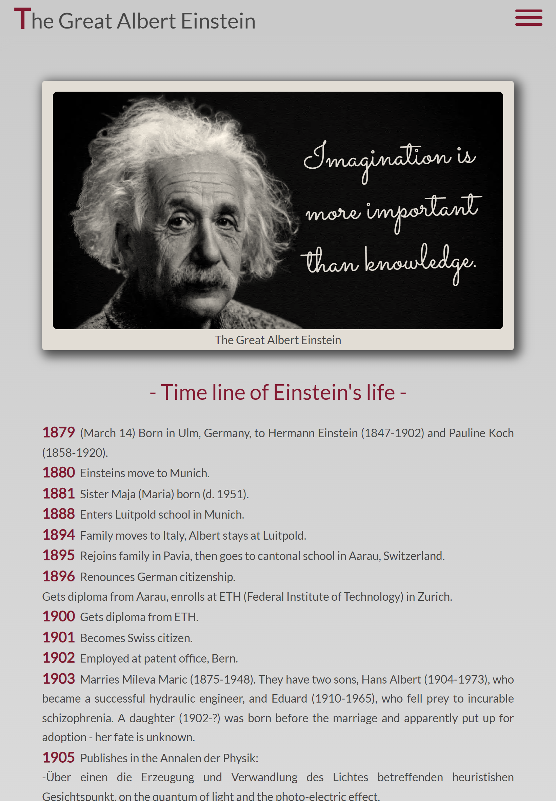
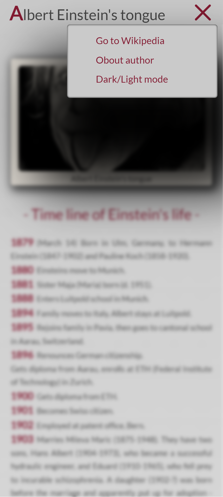
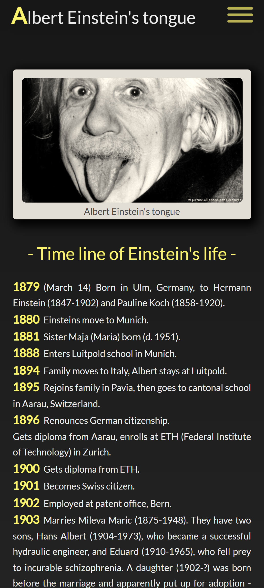
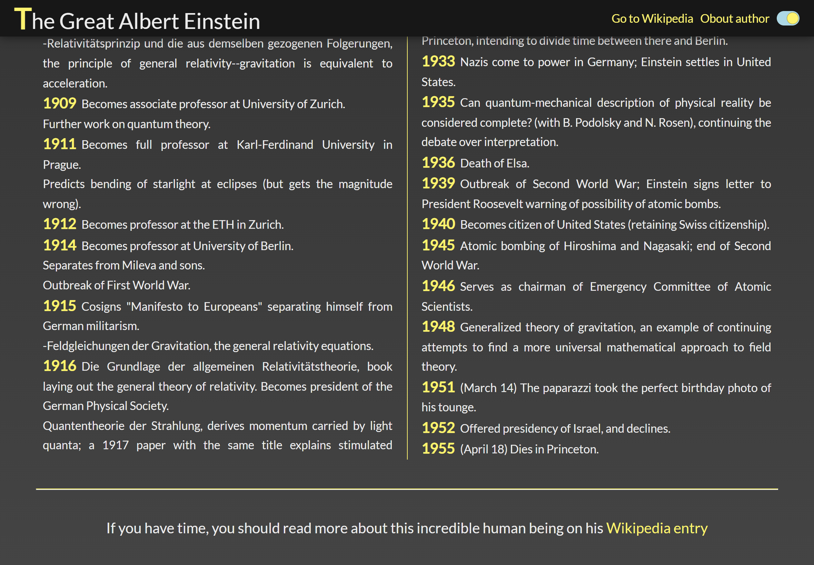

# freeCodeCamp Responsive Web Design certification

## Build a Tribute Page project

Working example: https://raff1010x.github.io/02.Responsive-Web-Design-Projects--Build-a-Tribute-Page/

My git repo: https://github.com/Raff1010X/01.Roadmap
##

##

##

##

##

